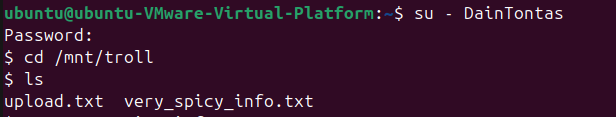
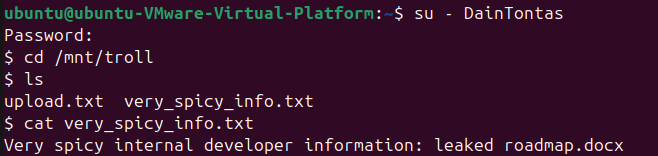
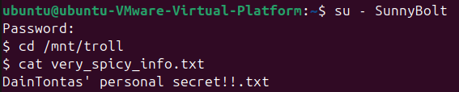
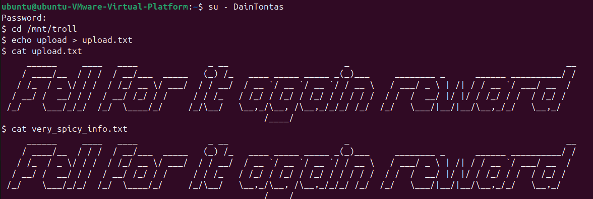
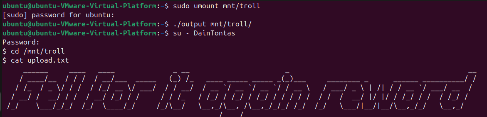

[_

</div>

### Daftar Soal _(Task List)_

- [Task 1 - FUSecure](/task-1/)

- [Task 2 - LawakFS++](/task-2/)

- [Task 3 - Drama Troll](/task-3/)

- [Task 4 - LilHabOS](/task-4/)

### Laporan Resmi Praktikum Modul 4 _(Module 4 Lab Work Report)_

### Task 3 - Drama Troll

**- Answer:**

Membuat user dan password

```bash
sudo useradd -m DainTontas
sudo useradd -m SunnyBolt
sudo useradd -m Ryeku

sudo passwd DainTontas
sudo passwd SunnyBolt
sudo passwd Ryeku
```

troll.c

```troll.c
#define FUSE_USE_VERSION 26
#include <fuse.h>
#include <string.h>
#include <errno.h>
#include <stdio.h>
#include <pwd.h>
#include <unistd.h>
#include <sys/types.h>

static const char *file1 = "very_spicy_info.txt";
static const char *file2 = "upload.txt";
static const char *trigger_flag = "/tmp/troll_trigger";

const char *ascii_art =
"     ______     ____   ____              _ __                       _                                           __\n"
"    / ____/__  / / /  / __/___  _____   (_) /_   ____ _____ _____ _(_)___     ________ _      ______ __________/ /\n"
"   / /_  / _ \\/ / /  / /_/ __ \\/ ___/  / / __/  / __ `/ __ `/ __ `/ / __ \\   / ___/ _ \\ | /| / / __ `/ ___/ __  / \n"
"  / __/ /  __/ / /  / __/ /_/ / /     / / /_   / /_/ / /_/ / /_/ / / / / /  / /  /  __/ |/ |/ / /_/ / /  / /_/ /  \n"
" /_/    \\___/_/_/  /_/  \\____/_/     /_/\\__/   \\__,_/\\__, /\\__,_/_/_/ /_/  /_/   \\___/|__/|__/\\__,_/_/   \\__,_/  \n"
"                                                    /____/                                                        \n";

int trigger(){
    return access(trigger_flag, F_OK) == 0;
}

static int xmp_getattr(const char *path, struct stat *stbuf){
    memset(stbuf, 0, sizeof(struct stat));

    if (strcmp(path, "/") == 0){
        stbuf->st_mode = S_IFDIR | 0755;
        stbuf->st_nlink = 2;
    } else if (strcmp(path, "/very_spicy_info.txt") == 0 || strcmp(path, "/upload.txt") == 0){
        stbuf->st_mode = S_IFREG | 0666;
        stbuf->st_nlink = 1;
        stbuf->st_size = 1024;
    } else return -ENOENT;

    return 0;
}

static int xmp_readdir(const char *path, void *buf, fuse_fill_dir_t filler, off_t offset, struct fuse_file_info *fi){
    (void) offset;
    (void) fi;

    if (strcmp(path, "/") != 0) return -ENOENT;

    filler(buf, ".", NULL, 0);
    filler(buf, "..", NULL, 0);
    filler(buf, file1, NULL, 0);
    filler(buf, file2, NULL, 0);

    return 0;
}

static int xmp_open(const char *path, struct fuse_file_info *fi){
    if (strcmp(path, "/very_spicy_info.txt") == 0 || strcmp(path, "/upload.txt") == 0)
        return 0;
    return -ENOENT;
}

static int xmp_read(const char *path, char *buf, size_t size, off_t offset, struct fuse_file_info *fi){
    (void) fi;

    uid_t uid = fuse_get_context()->uid;
    struct passwd *pw = getpwuid(uid);
    const char *user = pw->pw_name;

    if (strstr(path, ".txt") && trigger() && strcmp(user, "DainTontas") == 0) {
        size_t len = strlen(ascii_art);
        if (offset < len){
            if (offset + size > len) size = len - offset;
            memcpy(buf, ascii_art + offset, size);
        } else size = 0;

        return size;
    }

    if (strcmp(path, "/very_spicy_info.txt") == 0){
        const char *content;

        if (strcmp(user, "DainTontas") == 0){
            content = "Very spicy internal developer information: leaked roadmap.docx\n";
        } else {
            content = "DainTontas' personal secret!!.txt\n";
        }

        size_t len = strlen(content);
        if (offset < len){
            if (offset + size > len) size = len - offset;
            memcpy(buf, content + offset, size);
        } else size = 0;

        return size;

    } else if (strcmp(path, "/upload.txt") == 0){
        return 0;
    }

    return -ENOENT;
}

void trigger_trap(){
    FILE *f = fopen(trigger_flag, "w");
    if (f) fclose(f)
}

static int xmp_write(const char *path, const char *buf, size_t size, off_t offset, struct fuse_file_info *fi){
    (void) fi;
    (void) offset;

    uid_t uid = fuse_get_context()->uid;
    struct passwd *pw = getpwuid(uid);
    const char *user = pw->pw_name;

    if (strcmp(path, "/upload.txt") == 0 && !trigger() && strcmp(user, "DainTontas") == 0){
        trigger_trap();
        return size;
    }
    return -EACCES;
}

static int xmp_truncate(const char *path, off_t size){
    if (strcmp(path, "/upload.txt") == 0) return 0;
    return -EACCES;
}

static struct fuse_operations troll_oper = {
    .getattr = xmp_getattr,
    .readdir = xmp_readdir,
    .open    = xmp_open,
    .read    = xmp_read,
    .write   = xmp_write,
    .truncate = xmp_truncate,
};

int main(int argc, char *argv[]){
    return fuse_main(argc, argv, &troll_oper, NULL);
}
```

**Explanation:**

Subsoal a
Pertama, membuat ketiga  user dengan perintah `user` dengan opsi `-m` agar direktori home dibuat otomatis oleh sistem .
Lalu untuk password masing_masing user dibuat dengan perintah `passwd`

Subsoal b
Filesystem FUSE ini akan dipasang di direktori `/mnt/troll` yang dibuat menggunakan perintah `mkdir`. Mount ini hanya memliki dua 
file`very_spicy_info.txt` dan `upload.txt`. Tidak ada file atau direktori lain yang diperlihatkan. Hal ini dilakukan dengan membatasi
isi filesystem pada fungsi `xmp_readdir`. Fungsi `xmp_getattr` akan memverifikasi path yang diminta adalah root direktori `/` atau 
satu dari dua file tersebut. Jika selain itu, maka akan mengembalikan error `-ENOENT`.

Subsoal c
Fungsi `xmp_read` akan mengatur isi file secara berdasarkan UID dari user yang sedang mengakses. UID ini diperoleh menggunakan 
`fuse_get_context()->uid`, lalu dicocokkan ke nama user dengan fungsi `getpwuid()`. Jika file very_spicy_info.txt dibuka oleh 
DainTontas, maka akan keluar "Very spicy internal developer information: leaked roadmap.docx". Namun, jika file tersebut dibuka 
oleh SunnyBolt atau Ryeku maka akan keluar "DainTontas' personal secret!!.txt". Jika user membuka `upload.txt` tidak akan mengeluarkan
apapun. `Fungsi xmp_open` digunakan untuk membuka file.

Subsoal d
Mendeklarasikan variabel `trigger_flag`, yang disimpan di path `/tmp/troll_trigger`. Fungsi `trigger_trap` digunakan untuk
membuat file `trigger_troll`. Fungsi `trigger` digunakan untuk memeriksa apakah file ini ada atau tidak. Jika ada, maka akan 
mengembalikan `1/true` dan jika tidak `0/false`. Fungsi `xmp_write` digunakan untuk menulis ke file `upload.txt`. Jika user
DainTontas menulis sesuatu, maka akan membuat file `trigger_troll`; Fungsi `xmp_truncate` digunakan untuk mengubah ukuran file 
`upload.txt` menjadi 0. Karena perintah `echo` akan terlebih dahulu memangkas isi file menggunakan `truncate()`, lalu baru menulis 
isi baru ke file tersebut melalui `write()`. Modifikasi fungsi `xmp_read` dengan menambahkan pengecekan. Jika file yang dibaaca `.txt`
, fungsi `trigger` return 1, dan user yang sedang akses adalah DainTontas, makan akan menampilkan ascii art "Fell for it again reward".

**Screenshot:**

Isi direktori /mnt/troll


Jika yang membuka file very_spicy_info.txt adalah DainTontas


Jika yang membuka file very_spicy_info.txt adalah SunnyBolt dan Ryeku


Saat trap sudah aktif


Saat diumount trap tetap aktif

